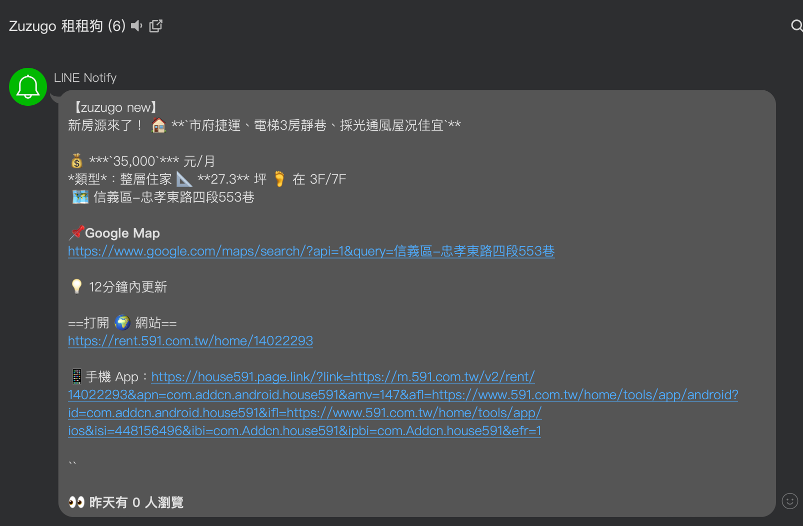
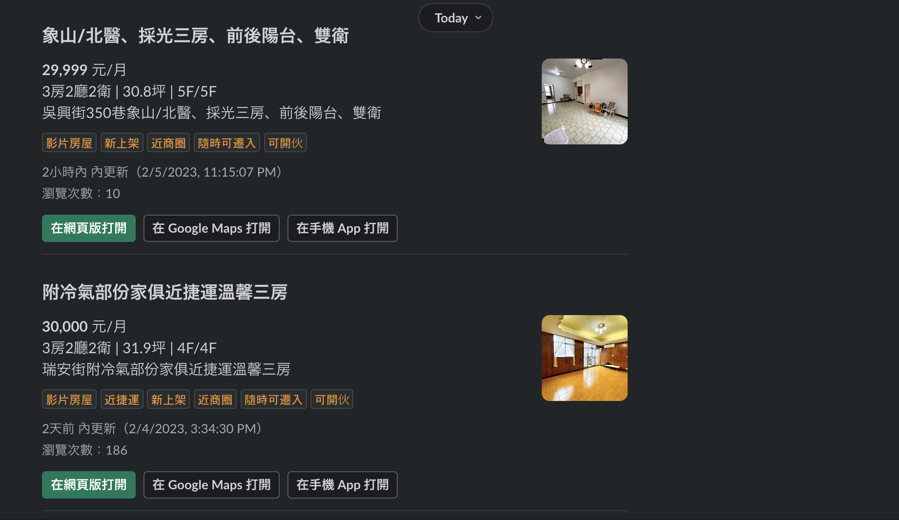

# Zuzugo 租租狗

<p align="center">
  
  <br>
  <br>
  抓取 591 最新租屋資訊，並提供聊天機器人通知（可簡易的擴充）
</p>

Status page: <https://zuzugo.instatus.com/>

## Screenshots

|                  Line Notify                  |                 Slack Bot                 |
| :-------------------------------------------: | :---------------------------------------: |
|  |  |

## Roadmap

[參見 GitHub Project](https://github.com/users/Yukaii/projects/5/views/2)

## Development

1. Clone 專案，然後

```bash
pnpm install
cp .env.example .env
```

2. 更新 .env

```
SLACK_CLIENT_ID=
SLACK_CLIENT_SECRET=
SLACK_REDIRECT_URI=

# 開發可以先關掉
DISABLE_CRON=true

# 記得先 createdb zuzugo-dev
DATABASE_URL=postgres://postgres@localhost:5432/zuzugo-dev?schema=public
```

3. Primsa 相關

```bash
pnpm prisma generate
pnpm prixma migrate deploy
```


```bash
# start the inngest dev server
pnpm inngest-dev
```

## Previous Works

- [zuzugo-legacy](https://github.com/Yukaii/zuzugo-legacy)：舊版租租狗，那時候只寫完爬蟲部分（現已失效，於是重寫），去參加 g0v 的 rentea 小聚，得知[豬豬快租](https://www.facebook.com/zuzutw/)因為~~大人的理由~~[下架了](https://www.facebook.com/zuzutw/posts/pfbid0Jiys6uatCsuhS76q3DSz7Atk3XuUQbKmwah8Q9trNbYVpXW8moDk4N5VJhjfmH46l)，剛好那時程式還沒寫完就找到房子，結果儘管 README 洋洋灑灑一堆，仍舊棄坑爛尾怪 XD
- [https://github.com/aiyu666/rentHouse](https://github.com/aiyu666/rentHouse) 以及各種 forks：這次重寫 zuzugo 想說也不要重造太多輪子，GitHub 搜尋 591 前幾名又是 JavaScript 就直接拿來改了。
  - [https://github.com/uier/rentHouse](https://github.com/uier/rentHouse) (AppLink 網址參考)
  - [https://github.com/zephyrxvxx7/rentHouse](https://github.com/zephyrxvxx7/rentHouse) (591 API 修正參考)

## Misc：關於命名

- 豬豬快租 -> zuzu.com.tw
- [bbgo](https://github.com/c9s/bbgo) -> BB 狗，雖然本專案沒有半行 Go...


## Slack App setup

1. Go <https://api.slack.com/apps?new_app=1> to create a new app from manifest
2. Use the following manifest (TBD)

```json
{
  "display_information": {
    "name": "zuzugo"
  },
  "features": {
    "bot_user": {
      "display_name": "zuzugo",
      "always_online": true
    },
    "slash_commands": [
      {
        "command": "/zuzugo",
        "url": "https://your-zuzugo-domain/api/slack",
        "description": "zuzugo commands!",
        "should_escape": false
      }
    ]
  },
  "oauth_config": {
    "redirect_urls": [
      "https://your-zuzugo-domain/api/slack/oauth_redirect",
      "https://your-zuzugo-domain/api/auth/callback/slack"
    ],
    "scopes": {
      "bot": [
        "commands"
      ]
    }
  },
  "settings": {
    "org_deploy_enabled": false,
    "socket_mode_enabled": false,
    "token_rotation_enabled": false
  }
}
```

1. Go to <https://your-zuzugo-domain/api/slack/install>
1. Click `Add to Slack channel`, select the channel you want to receive the notification
1. Finish Oauth login
1. Check the database, you should see SlackAppInstallation table has a new record

## License

MIT
